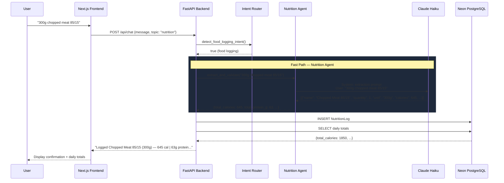
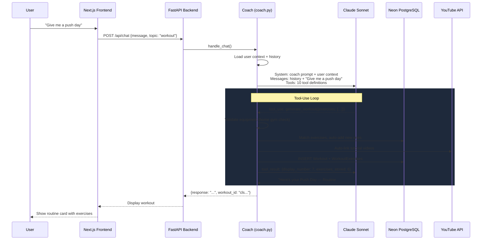
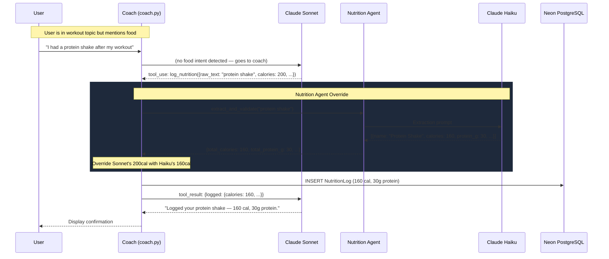

# FitClaude System Architecture

```mermaid
graph TB
    subgraph Client["Frontend — Next.js 16 + React 19"]
        UI["Mobile PWA UI"]
        Pages["Pages"]
        API_Routes["API Routes"]

        UI --> Pages
        Pages --> API_Routes

        subgraph PagesDetail["Pages"]
            Dashboard["/  Dashboard"]
            Chat["/chat  Coach Fit"]
            Workouts["/workouts  Routines & History"]
            Nutrition["/nutrition  Meal Logging"]
            Analytics["/analytics  Stats & Muscles Worked"]
            Exercises["/exercises  Exercise Library"]
            Settings["/settings  Profile & Targets"]
            Onboarding["/onboarding  New User Setup"]
        end

        subgraph APIRoutes["Next.js API Routes"]
            R_Profile["GET/PATCH /api/profile"]
            R_Workouts["GET /api/workouts"]
            R_WorkoutID["GET/PATCH/DELETE /api/workouts/:id"]
            R_Exercises["GET /api/exercises"]
            R_NutritionToday["GET /api/nutrition/today"]
            R_NutritionHistory["GET /api/nutrition/history"]
            R_Analytics["GET /api/analytics"]
            R_Chat["POST /api/chat → proxy"]
            R_Activities["GET/DELETE /api/activities"]
        end
    end

    subgraph Auth["Auth — NextAuth v5"]
        Google["Google OAuth"]
        Sessions["Database Sessions"]
        Google --> Sessions
    end

    subgraph DB["Database — Neon PostgreSQL"]
        Prisma["Prisma ORM (Frontend)"]
        SQLAlchemy["SQLAlchemy async (Backend)"]

        subgraph Tables["Tables"]
            T_User["User"]
            T_Workout["Workout"]
            T_WorkoutExercise["WorkoutExercise"]
            T_Exercise["Exercise"]
            T_ExerciseVariation["ExerciseVariation"]
            T_NutritionLog["NutritionLog"]
            T_Activity["Activity"]
            T_UserFood["UserFood"]
            T_ExerciseVideo["ExerciseVideo"]
            T_ConversationHistory["ConversationHistory"]
            T_TokenUsage["TokenUsage"]
        end
    end

    subgraph Backend["Backend — FastAPI (Python)"]
        FastAPI["FastAPI App"]
        ChatRouter["/api/chat Endpoint"]

        FastAPI --> ChatRouter

        subgraph AgentSystem["agents/"]
            Coach["Coach Agent<br/>agents/coach.py"]
            IntentRouter["Intent Router<br/>router/intent.py"]
            Dispatcher["Dispatcher<br/>router/dispatcher.py"]

            subgraph NutritionAgent["agents/nutrition/"]
                NA_Agent["NutritionAgent"]
                NA_Prompt["Extraction Prompt"]
                NA_Schema["FoodItem Schema"]
                NA_Known["Known Foods DB"]
                NA_Agent --> NA_Prompt
                NA_Agent --> NA_Schema
                NA_Agent --> NA_Known
            end

            subgraph WorkoutAgent["agents/workout/ (future)"]
                WA_Placeholder["Handled by Coach"]
            end

            subgraph CoachTools["Coach Tools (10)"]
                T_GenWorkout["generate_workout"]
                T_LogNutrition["log_nutrition"]
                T_LogActivity["log_activity"]
                T_LogRoutineDone["log_routine_done"]
                T_GetHistory["get_workout_history"]
                T_GetNutrition["get_daily_nutrition"]
                T_SpicyVar["get_spicy_variation"]
                T_MarkComplete["mark_workout_complete"]
                T_LookupFoods["lookup_user_foods"]
                T_YouTube["parse_youtube_video"]
            end

            SpicyEngine["Spicy Variation Engine<br/>agents/spicy.py"]
            MiniMax["MiniMax Fallback<br/>agents/minimax_fallback.py"]
        end

        subgraph Services["Services"]
            UsageService["Usage Service<br/>Rate Limits & Tiers"]
            YouTubeService["YouTube Service<br/>Video Import"]
            VideoLinker["Video Linker<br/>Auto-link Tutorials"]
        end
    end

    subgraph AI["AI APIs"]
        Claude_Sonnet["Claude Sonnet<br/>(Main Coach)"]
        Claude_Haiku["Claude Haiku<br/>(Nutrition Agent)"]
        MiniMax_API["MiniMax API<br/>(Fallback)"]
    end

    subgraph Infra["Infrastructure"]
        Vercel["Vercel<br/>Frontend Hosting"]
        VPS["Hostinger VPS<br/>Backend (systemd + uvicorn)"]
        Neon["Neon Cloud<br/>PostgreSQL"]
        YouTube_API["YouTube API<br/>Video Search"]
    end

    %% ── Data Flow ──

    %% Frontend → Backend
    R_Chat -->|"POST /api/chat"| ChatRouter
    API_Routes -->|"Prisma"| Prisma
    Prisma --> Tables
    SQLAlchemy --> Tables

    %% Auth
    UI --> Auth
    Sessions -->|"Prisma Adapter"| T_User

    %% Chat flow
    ChatRouter --> Dispatcher
    Dispatcher -->|"food logging intent"| NA_Agent
    Dispatcher -->|"everything else"| Coach

    %% Coach → Claude
    Coach -->|"tool-use loop"| Claude_Sonnet
    Coach -->|"fallback"| MiniMax

    %% Nutrition Agent → Claude Haiku
    NA_Agent -->|"extraction prompt"| Claude_Haiku

    %% Coach tools → DB
    T_GenWorkout --> SQLAlchemy
    T_LogNutrition -->|"calls nutrition agent"| NA_Agent
    T_LogNutrition --> SQLAlchemy
    T_LogActivity --> SQLAlchemy
    T_LogRoutineDone --> SQLAlchemy
    T_GetHistory --> SQLAlchemy
    T_GetNutrition --> SQLAlchemy
    T_SpicyVar --> SpicyEngine
    SpicyEngine --> SQLAlchemy
    T_LookupFoods --> SQLAlchemy
    T_YouTube --> YouTubeService

    %% Services
    UsageService --> T_TokenUsage
    YouTubeService --> YouTube_API
    VideoLinker --> T_ExerciseVideo

    %% Infrastructure
    Client --> Vercel
    Backend --> VPS
    DB --> Neon

    %% Styling
    classDef frontend fill:#1e293b,stroke:#10b981,color:#ededed
    classDef backend fill:#1e293b,stroke:#3b82f6,color:#ededed
    classDef ai fill:#1e293b,stroke:#f59e0b,color:#ededed
    classDef db fill:#1e293b,stroke:#8b5cf6,color:#ededed
    classDef infra fill:#1e293b,stroke:#6b7280,color:#ededed

    class Client,UI,Pages,API_Routes,PagesDetail,APIRoutes frontend
    class Backend,FastAPI,ChatRouter,AgentSystem,Coach,IntentRouter,Dispatcher,NutritionAgent,WorkoutAgent,CoachTools,SpicyEngine,MiniMax,Services frontend
    class Claude_Sonnet,Claude_Haiku,MiniMax_API ai
    class DB,Prisma,SQLAlchemy,Tables db
    class Infra,Vercel,VPS,Neon,YouTube_API infra
```

## Message Flow: Food Logging

```mermaid
sequenceDiagram
    participant U as User
    participant FE as Next.js Frontend
    participant BE as FastAPI Backend
    participant IR as Intent Router
    participant NA as Nutrition Agent
    participant H as Claude Haiku
    participant DB as Neon PostgreSQL

    U->>FE: "300g chopped meat 85/15"
    FE->>BE: POST /api/chat {message, topic: "nutrition"}
    BE->>IR: detect_food_logging_intent()
    IR-->>BE: true (food logging)

    rect rgb(30, 41, 59)
        Note over BE,H: Fast Path — Nutrition Agent
        BE->>NA: extract_and_validate("300g chopped meat 85/15")
        NA->>H: System: extraction prompt<br/>User: "300g chopped meat 85/15"
        H-->>NA: [{"name": "Chopped Meat 85/15", "quantity": 1, "unit": "300g", "calories": 645, ...}]
        NA-->>BE: {total_calories: 645, total_protein_g: 63, ...}
    end

    BE->>DB: INSERT NutritionLog
    BE->>DB: SELECT daily totals
    DB-->>BE: {total_calories: 1850, ...}
    BE-->>FE: "Logged Chopped Meat 85/15 (300g) — 645 cal | 63g protein..."
    FE-->>U: Display confirmation + daily totals
```

## Message Flow: Workout Generation

```mermaid
sequenceDiagram
    participant U as User
    participant FE as Next.js Frontend
    participant BE as FastAPI Backend
    participant C as Coach (coach.py)
    participant S as Claude Sonnet
    participant DB as Neon PostgreSQL
    participant YT as YouTube API

    U->>FE: "Give me a push day"
    FE->>BE: POST /api/chat {message, topic: "workout"}
    BE->>C: handle_chat()
    C->>C: Load user context + history
    C->>S: System: coach prompt + user context<br/>Messages: history + "Give me a push day"<br/>Tools: 10 tool definitions

    rect rgb(30, 41, 59)
        Note over C,S: Tool-Use Loop
        S-->>C: tool_use: generate_workout({exercises: [...]})
        C->>C: Validate equipment (home gym check)
        C->>DB: Match exercises, auto-add new ones
        C->>YT: Auto-link tutorial videos
        C->>DB: INSERT Workout + WorkoutExercises
        C->>S: tool_result: {display_number: 7, exercises_stored: 6}
        S-->>C: "Here's your Push Day — Routine #7! 💪..."
    end

    C-->>BE: {response: "...", workout_id: "cls..."}
    BE-->>FE: Display workout
    FE-->>U: Show routine card with exercises
```

## Message Flow: Coach Handles Nutrition (Fallback Path)

```mermaid
sequenceDiagram
    participant U as User
    participant C as Coach (coach.py)
    participant S as Claude Sonnet
    participant NA as Nutrition Agent
    participant H as Claude Haiku
    participant DB as Neon PostgreSQL

    Note over U,C: User is in workout topic but mentions food

    U->>C: "I had a protein shake after my workout"
    C->>S: (no food intent detected — goes to coach)
    S-->>C: tool_use: log_nutrition({raw_text: "protein shake", calories: 200, ...})

    rect rgb(30, 41, 59)
        Note over C,H: Nutrition Agent Override
        C->>NA: extract_and_validate("protein shake")
        NA->>H: Extraction prompt
        H-->>NA: [{name: "Protein Shake", calories: 160, protein_g: 30, ...}]
        NA-->>C: {total_calories: 160, total_protein_g: 30, ...}
        Note over C: Override Sonnet's 200cal with Haiku's 160cal
    end

    C->>DB: INSERT NutritionLog (160 cal, 30g protein)
    C->>S: tool_result: {logged: {calories: 160, ...}}
    S-->>C: "Logged your protein shake — 160 cal, 30g protein."
    C-->>U: Display confirmation
```
